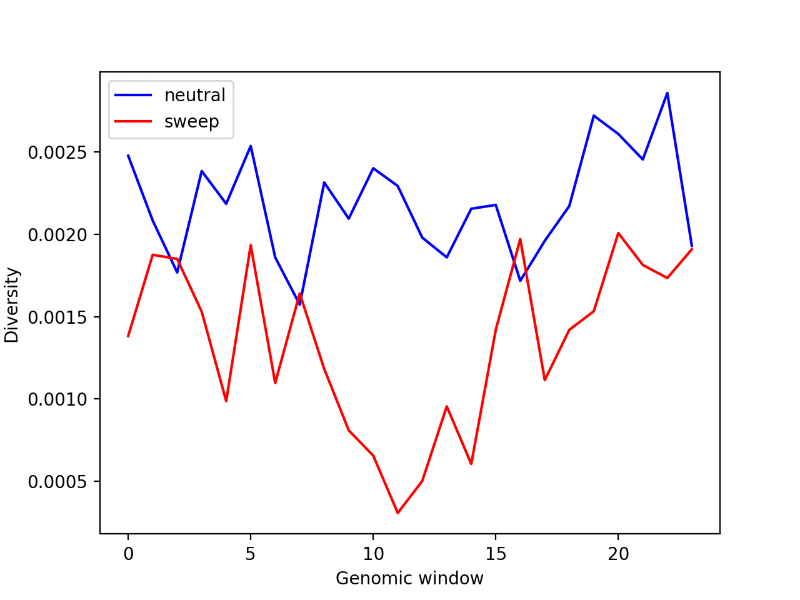
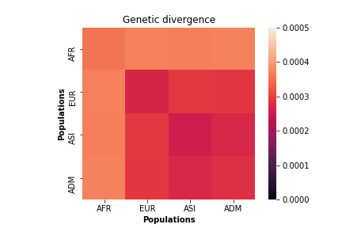
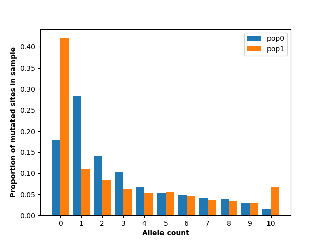

.. _sec_tutorial:

=========
Tutorials
=========

There are two main ways of accessing the resources of the ``stdpopsim`` package
that will be detailed in this tutorial. The first is via the command line
interface (CLI). This is useful if you want to do a straightforward run of the
models in the ``stdpopsim`` :ref:`catalog <sec_catalog>`. The other way to
access the ``stdpopsim`` resources is via the python API. This is a bit more
complicated, but allows for more advanced tasks. This tutorial will walk
through both ways of using the ``stdpopsim`` package as well as a few examples
of producing and processing output.

To simulate genomes using ``stdpopsim``,
we need to make several choices about what will be simulated:

1. which species
2. which contig (i.e., how much of what chromosome)
3. which genetic map
4. which demographic model
5. how many samples from each population of the model
6. which simulation engine to use

These choices are nested:
the species determines what contigs, genetic maps, and demographic models are available,
and the demographic model determines how many populations can be sampled from.
Currently, the two choices of simulation engine are ``msprime`` and ``SLiM``.
Below are examples of making these choices in various contexts,
using both CLI and python interfaces.

.. _sec_cli_tute:

***********************************************************
Running ``stdpopsim`` with the command-line interface (CLI)
***********************************************************

In order to use the ``stdpopsim`` CLI the ``stdpopsim`` package must be
installed (see :ref:`Installation <sec_installation>`). The CLI provides access
to the :ref:`catalog <sec_catalog>` of models that have already been implemented
by ``stdpopsim``.

A first simulation
==================

As a first step, we'll use the CLI built-in help
to build up to a realistic coalescent simulation of some copies of
human chromosome 22 with the HapMap genetic map,
and a published demographic model.

Choose a species and a contig
-----------------------------

The first step for using the CLI is to select the species that
you are interested in simulating data for. In order to see which species are
available run

.. command-output:: stdpopsim --help

This shows the species currently supported by ``stdpopsim``. This means that
``stdpopsim`` knows various traits of these species including chromosome size
and recombination rates. Once we've selected a species, in this case humans, we
can look at the help again as follows.

.. command-output:: stdpopsim HomSap --help
    :ellipsis: 20

For conciseness we do not show all the output here but this time you should see a
different output which shows options for performing the simulation itself and
the species default parameters. This includes selecting the demographic model,
chromosome, recombination map, and number of samples.

The most basic simulation we can run is to simulate two (haploid) genomes
- i.e., two samples -
using the species' defaults as seen in the species help (``stdpopsim HomSap --help``).
These defaults include constant size population, a uniform recombination map based
on the average recombination rate (either genome-wide or within a chromosome, if
specified), and the mutation rate shown above.
To save time we will specify that the simulation use
chromosome 22, using the ``-c`` option. We also specify that the resulting
tree-sequence formatted output should be written to the file ``foo.ts`` with the
``-o`` option. For more information on how to use tree-sequence files see
`tskit <https://tskit.dev/tskit/docs/stable/introduction.html>`__.

.. code-block:: console

    $ stdpopsim HomSap -c chr22 -o foo.ts 2

.. warning:: It's important to remember to either redirect the output of ``stdpopsim``
                to file or to use the ``-o/--output`` option. If you do not, the
                binary output may mess up your terminal session.

Choose a model and a sampling scheme
------------------------------------

Next, suppose we want to use a specific demographic model. We look up the available models
using the ``--help-models`` flag (here, truncated for space):

.. command-output:: stdpopsim HomSap --help-models
    :ellipsis: 30

This gives all of the possible demographic models we could simulate. We choose
the two population out-of-Africa :ref:`model <sec_catalog_homsap_models_outofafrica_2t12>`
from `Tennesen et al. (2012) <https://doi.org/10.1126/science.1219240>`_ .
By looking at the model help we find that the name for this model is
``OutOfAfrica_2T12`` and that we can specify it using
the ``--demographic-model`` or ``-d`` option. We choose to draw two samples from the
"African American" population and three samples from the "European American" population.
To increase simulation speed we can also choose to simulate a sequence that is
a fraction of the length of the specified chromosome using the ``-l`` option
(e.g. 5%). This is just specifying a sequence length, not actually selecting
a subset of the chromosome to sequence and as such cannot be used with anything
other than a uniform recombination map. The command now looks like this:

.. code-block:: console

    $ stdpopsim HomSap -c chr22 -l 0.05 -o foo.ts -d OutOfAfrica_2T12 2 3

Note that the number of samples from each population are simply specified
as two numbers at the end of the command. There must be *two* numbers because the
model has two populations that we can sample from
The order of those numbers is the same as the order
specified in the model documentation. In this case, ``2 3`` means
we are simulating two African American samples and three European American samples.

.. note::
    Many demographic models were inferred or calibrated using a mutation rate that
    differs from the cataloged species' mutation rate. Simulations using the CLI now
    automatically use the *model's* specified mutation rate instead of the species
    rate, so that expected levels of diversity more closely match those observed in
    the data that were used to infer the demographic model. For generic demographic
    models or those without associated mutation rates, the species mutation rate is
    used.

Now we want to add an empirical recombination map to make the simulation more
realistic. We can look up the available recombination maps using the
``--help-genetic-maps`` flag (here, truncated for space):

.. command-output:: stdpopsim HomSap --help-genetic-maps
    :ellipsis: 15

In this case we choose the
:ref:`sec_catalog_homsap_genetic_maps_hapmapii_grch37` map. Empirical
recombination maps cannot be used with length multipliers so we have to remove
the ``-l`` option. (NOTE: this may a minute or so to run).

.. code-block:: console

    $ stdpopsim HomSap -g HapMapII_GRCh37 -c chr22 -o foo.ts -d OutOfAfrica_2T12 2 3

For reproducibility we can also choose set the seed for the simulator using the
``-s`` flag.

.. code-block:: console

    $ stdpopsim HomSap -s 1046 -g HapMapII_GRCh37 -c chr22 -o foo.ts -d OutOfAfrica_2T12 2 3

On running these commands, the CLI also outputs the relevant citations for both
the simulator used and the resources used for simulation scenario.

.. _sec_cli_vcf_output:

Convert output to VCF
---------------------

The output from a ``stdpopsim`` simulation is a *tree sequence*,
a compact and efficient format for storing both genealogies and genome sequence.
Some examples of analyzing tree sequences are given
:ref:`below <sec_tute_analyses>`.
If desired, these can be converted to VCF on the command line if the
`tskit <https://tskit.dev/tskit/>`__ package is installed,
with the ``tskit vcf`` command:

.. code-block:: console

   $ tskit vcf foo.ts > foo.vcf

For this small example (only five samples), the file sizes are similar,
but the tree sequence is slightly larger
(it does carry a good bit more information about the trees, after all).
However, if we up the sample sizes to 2000 and 3000
(the simulation is still pretty quick)
the tree sequence is twenty-three times smaller:

.. code-block:: console

   $ stdpopsim HomSap -s 1046 -g HapMapII_GRCh37 -c chr22 -o foo.ts -d OutOfAfrica_2T12 2000 3000
   $ tskit vcf foo.ts > foo.vcf
   $ ls -lth foo.*
   -rw-r--r-- 1 peter peter 3139M Apr  3 10:40 foo.vcf
   -rw-r--r-- 1 peter peter  136M Apr  3 10:39 foo.ts

Zipping the files (using the `tszip <https://tszip.readthedocs.io/en/latest/>`__
package) reduces this difference quite a lot,
but increases time required for processing:

.. code-block:: console

   $ tskit vcf foo.ts | gzip -c > foo.vcf.gz
   $ tszip foo.ts
   $ ls -lth foo.*
   -rw-r--r-- 1 peter peter  31M Apr  3 10:51 foo.ts.tsz
   -rw-r--r-- 1 peter peter  72M Apr  3 10:50 foo.vcf.gz

Using the SLiM simulation engine
================================

The default "simulation engine" -
i.e., the program that actually does the simulating -
is `msprime <https://tskit.dev/msprime/>`__,
a coalescent simulator.
However, it is also possible to swap this out for
`SLiM <https://messerlab.org/slim/>`__,
a forwards-time, individual-based simulator.

Specifying the engine
---------------------

Using SLiM is as easy as passing the ``--engine/-e`` flag
(we didn't do this above, so it used the default engine, msprime).
For instance, to use SLiM to simulate the same 5% chunk of chromosome 22
under the ``OutOfAfrica_2T12`` model as above,
we would just run:

.. code-block:: console

    $ stdpopsim -e slim HomSap -c chr22 -l 0.05 -o foo.ts -d OutOfAfrica_2T12 2 4

Here we've changed the sample sizes to be even:
SLiM simulates diploid individuals, but sample sizes are in numbers of chromosomes,
so if you ask for an odd number, it will be rounded up to an even number.
**But:** this simulation can take quite a while to run,
so before you try that command out, **read on!**

.. _sec_slim_scaling_factor:

The scaling factor
------------------

However, even with only 5% of a chromosome,
that is a pretty big simulation, due to the large number of individuals
(unlike msprime, SLiM must actually simulate all the individuals in the population
even just to get a few samples).
To make it run fast enough for a tutorial,
we can specify a *scaling factor*,
described in more detail below (see :ref:`sec_slim_scaling_factor`),
using the ``--slim-scaling-factor`` option.
Unlike the previous command, this one should run very fast:

.. code-block:: console

    $ stdpopsim -e slim --slim-scaling-factor 10 HomSap \
    $    -c chr22 -l 0.05 -o foo.ts -d OutOfAfrica_2T12 2 4

(Indeed, this example runs in less than a minute,
but without setting the scaling factor, leaving at its default of 1.0,
it takes on the same computer about 20 minutes.)
Briefly, what this does is reduces all the population sizes by a "scaling factor"
(here set to 10), and rescales time by the same factor,
thus increasing mutation, recombination, and population growth rates.
A model with selection would need to have selection coefficients multiplied by the factor as well.
This results in a model that is equivalent in many senses -
the same rate of genetic drift, the same expected decay of linkage disequilibrium -
but generally runs much faster because there are fewer individuals to keep track of.
In practice, rescaling seems to produce indistinguishable results in much shorter times
at many parameter values.
However, the user should be aware that in principle, the results are **not** equivalent,
possibly in subtle and hard-to-understand ways.
This is particularly true in simulations with large amounts of selection.
See the SLiM manual and/or
`Urrichio & Hernandez (2014) <https://www.genetics.org/content/197/1/221.short>`__
for more discussion.

Simulating genomes with selection
---------------------------------

In the example above given a species, recombination map, and demography, a contig
was simulated assuming strictly neutrality. It is possible to incorporate selection in the
simulations by (1) specifying the Distribution of Fitness Effects (DFE) for all new mutations
across the entire contig or a subset of it; or by (2) adding a single mutation under selection,
as for instance in a selective sweep.

If a DFE is already described in the catalog, one can incorporate it into the simulation
with the flag ``--dfe``. For instance, HomSap has a DFE described as Gamma_K17.
To add it the example above we can type as follows:

.. code-block:: console

    $ stdpopsim -e slim --slim-scaling-factor 10 HomSap \
        -c chr22 -l 0.05 --dfe Gamma_K17 -o foo.ts -d OutOfAfrica_2T12 2 4

This example will simulate selection following the proportion of sites described in `Gamma_K17 <https://popsim-consortium.github.io/stdpopsim-docs/main/catalog.html#sec_catalog_homsap_dfes_gamma_k17>`_

Instead of simulating the whole contig one can simulate only coding sequence (CDS) by using the flag ``--dfe-annotation``
and specifying a CDS annotation:

.. code-block:: console

    $ stdpopsim -e slim --slim-scaling-factor 20 HomSap \
         -c chr22 --dfe Gamma_K17 -o foo.ts -d OutOfAfrica_2T12 \
         --dfe-annotation ensembl_havana_104_CDS 2 4

If instead of an annotation file one has a bed file (ex.bed) like the one below:

.. code-block:: console

     chr1  100000  145000
     chr1  150000  302425
     chr1  302430  303000

then it is possible to simulate selection in all intervals provided by the bed file by using the flag
``--dfe-bed-file`` as follow:

.. code-block:: console

    $ stdpopsim -e slim --slim-scaling-factor 10 HomSap \
         -c chr22 -l 0.05 --dfe Gamma_K17 -o foo.ts -d OutOfAfrica_2T12 \
         --dfe-bed-file ex.bed 2 4

The examples above (using the flags ``--dfe-annotation``, to use a named annotation, or ``--dfe-bed-file`` to include a bed file)
incorporate selection on the specified segments of genome.

To simulate, however, only a small chunk of contig with selection––as in a selective sweep––one can use the flag
``--dfe-interval``:

.. code-block:: console

    $ stdpopsim -e slim --slim-scaling-factor 10 HomSap \
        -c chr22 -l 0.05 --dfe Gamma_K17 -o foo.ts -d OutOfAfrica_2T12 \
        --dfe-interval 1000,100000 2 4

The DFE defined by Gamma_K17 will be incorporated only in positions between 1000 and 100000.

See also the python API to incorporate `selection <https://popsim-consortium.github.io/stdpopsim-docs/latest/tutorial.html#incorporating-selection>`__.

Debugging output from SLiM
==========================

Next we'll look at running a different model with SLiM,
but getting some sanity check output along the way.

Choose a species: Drosophila melanogaster
-----------------------------------------

Perusing the `Catalog <sec_catalog>`,
we see that to simulate copies of chromosome arm 2L
from *Drosophila melanogaster* individuals with the demographic model
inferred by `Sheehan & Song (2016) <https://doi.org/10.1371/journal.pcbi.1004845>`__,
using SLiM with a (very large!) scaling factor of 1000, we could run

.. code-block:: console

   $ stdpopsim -e slim --slim-scaling-factor 1000 DroMel\
   $     -c chr2L -l 0.05 -o foo.ts -d African3Epoch_1S16 100

The scaling factor of 1000 makes this model run very quickly,
but should also make you *very* nervous.
What actually *is* being simulated here?
We can at least find out what the actual population sizes are in the SLiM simulation
by asking the simulation to be more verbose.
Prepending the ``-v`` flag will request that SLiM print out information
every time a demographic event occurs
(helpfully, this also gives us an idea of how quickly the simulation is going):
This also outputs a fair bit of other debugging output,
which can be turned off with ``--quiet``:

.. code-block:: console

   $ stdpopsim -v -e slim --slim-scaling-factor 1000 DroMel \
   $     -c chr2L -l 0.05 -o foo.ts -d African3Epoch_1S16 100 --quiet

Trimming down the output somewhat, we get:

.. code-block:: console

   2020-04-03 22:05:52,160 [1098] DEBUG stdpopsim.species: Making flat chromosome 0.05 * chr2L
   2020-04-03 22:05:52,161 [1098] INFO stdpopsim.cli: Running simulation model African3Epoch_1S16 for DroMel on Contig(length=1.2E+06, recombination_rate=8.4E-09, mutation_rate=5.5E-09, genetic_map=None) with 100 samples using slim.

   1: sim.addSubpop(0, 652);
   1: Starting burn-in...
   6521: {dbg(self.source); p0.setSubpopulationSize(145);}
   8521: {dbg(self.source); p0.setSubpopulationSize(544);}
   8721: {dbg(self.source); inds=p0.sampleIndividuals(50); sim.treeSeqRememberIndividuals(inds);}
   8721: {dbg(self.source); end();}

This tells us that after rescaling by a factor of 1000,
the population sizes in the three epochs are 652, 145, and 544 individuals,
respectively.
No wonder it runs so quickly!
At the end, fifty (diploid) individuals are sampled,
to get us our requested 100 genomes.
These numbers are not obviously completely wrong,
as would be for instance if we had population sizes of 1 or 2 individuals.
However, extensive testing would need to be done to find out
if data produced with such an extreme scaling factor
actually resembles the data that would be produced without rescaling.

.. _sec_python_tute:

*************************************************
Running stdpopsim with the Python interface (API)
*************************************************

Nearly all the functionality of ``stdpopsim`` is available through the CLI,
but for complex situations it may be desirable to use python.
Furthermore, downstream analysis may happen in python,
using the `tskit <https://tskit.dev/tskit/>`__ tools for working
with tree sequences.
In order to use the ``stdpopsim`` API the ``stdpopsim`` package must be
installed (see :ref:`Installation <sec_installation>`).

.. _sec_tutorial_existing_models:

Running a published model
=========================

The first example uses a mostly default genome
with a published demographic model.

Pick a species and demographic model
------------------------------------

First, we will pick a species (here, humans) and the published demographic
model to simulated under. In ``stdpopsim`` there are two types of model: ones
taken to match the :ref:`demographic history reported in published papers
<sec_catalog>`, and :ref:`"generic" models <sec_api_generic_models>`. We'll
first simulate using a published model from the catalog. Let's see what
demographic models are available for humans:

.. code-block:: python

   import stdpopsim

   species = stdpopsim.get_species("HomSap")

   for x in species.demographic_models:
       print(x.id)

   # OutOfAfrica_3G09
   # OutOfAfrica_2T12
   # Africa_1T12
   # AmericanAdmixture_4B11
   # OutOfAfricaArchaicAdmixture_5R19
   # Zigzag_1S14
   # AncientEurasia_9K19
   # PapuansOutOfAfrica_10J19
   # AshkSub_7G19
   # OutOfAfrica_4J17

These models are described in detail in the :ref:`Catalog <sec_catalog>`.
We'll look at the first model, "OutOfAfrica_3G09", from
`Gutenkunst et al (2009) <https://doi.org/10.1371/journal.pgen.1000695>`__.
We can check how many populations exist in this model, and what they are:

.. code-block:: python

   model = species.get_demographic_model("OutOfAfrica_3G09")
   print(model.num_populations)
   # 3
   print(model.num_sampling_populations)
   # 3
   print([pop.name for pop in model.populations])
   # ['YRI', 'CEU', 'CHB']

This model has 3 populations, named YRI, CEU, CHB, and all three can be sampled from.
The number of "sampling" populations could be smaller than the number of populations,
since some models have ancient populations which are currently not allowed to be
sampled from - but that is not the case in this model.

Set up the contig
-----------------

We'll next define the contig, which contains information about the genome length we
want to simulate and recombination and mutation rates. Here, we use the human
chromosome 22. If no recombination map is specified, we assume a uniform genetic map
based on the average recombination rate for that chromosome.

.. code-block:: python

   contig = species.get_contig("chr22")

   # default is a flat genetic map
   print("mean recombination rate:", f"{contig.recombination_map.mean_rate:.3}")
   # mean recombination rate: 1.44e-08

   # and the default mutation rate is based on the species default
   print("mean mutation rate:", contig.mutation_rate)
   # mean mutation rate: 1.29e-08

   # but note that the mutation rate differs from the model's assumed rate
   print("model mutation rate:", model.mutation_rate)
   # model mutation rate: 2.35e-08

The Gutenkunst OOA model was inferred using a mutation rate much larger than the
default mutation rate in the `stdpopsim` catalog. As such, simulating using this
model and default rate will result in levels of diversity substantially lower than
expected for the human population data that this model was inferred from. To match
observed diversity in humans, we should instead use the mutation rate associated
with the demographic model:

.. code-block:: python

   contig = species.get_contig("chr22", mutation_rate=model.mutation_rate)
   print(contig.mutation_rate == model.mutation_rate)
   # True

Choose a sampling scheme and simulate
-------------------------------------

The final ingredient we need before simulating
is a specification of the number of samples from each population.
We'll simulate 10 samples each from YRI and CHB, and zero from CEU,
using ``msprime`` as the simulation engine:

.. code-block:: python

   samples = model.get_samples(10, 0, 10)
   engine = stdpopsim.get_engine("msprime")
   ts = engine.simulate(model, contig, samples)
   print(ts.num_sites)
   # 88063

And that's it! It's that easy! We now have a tree sequence
describing the history and genotypes of 20 genomes,
between which there are 88,063 variant sites.
(We didn't set the random seed, though, so you'll get a somewhat
different number.)

Let's look at the metadata for the resulting simulation,
to make sure that we've got what we want.
The metadata for the populations is stored in json,
so we use the json module to easily parse it:

.. code-block:: python

   import json

   ts.num_samples
   # 20
   for k, pop in enumerate(ts.populations()):
       popdata = json.loads(pop.metadata)
       print(
           f"The tree sequence has {len(ts.samples(k))} samples from "
           f"population {k}, which is {popdata['id']}."
       )

   # The tree sequence has 10 samples from population 0, which is YRI.
   # The tree sequence has 0 samples from population 1, which is CEU.
   # The tree sequence has 10 samples from population 2, which is CHB.

.. _sec_tutorial_generic_models:

Running a generic model
=======================

Next, we will simulate using a "generic" model, with piecewise constant
population size. This time, we will simulate a given genome length under
a flat recombination map, using an estimate of the
human effective population size from the :ref:`sec_catalog`.

Choose a species
----------------

Although the model is generic, we still need a species in order
to get the contig information.
Again, we'll use `Homo sapiens`, which has the id "HomSap".
(But, you could use any species from the :ref:`sec_catalog`!)

.. code-block:: python

    import stdpopsim

    species = stdpopsim.get_species("HomSap")

Set up the generic model
------------------------

Next, we set the model to be the generic piecewise constant size model, using the
predefined human effective population size (see :ref:`sec_catalog`).
Since we are providing only one effective population size, the model is a
single population of constant over all time.

.. code-block:: python

    model = stdpopsim.PiecewiseConstantSize(species.population_size)

Each species has a "default" population size, ``species.population_size``,
which for humans is 10,000.

Choose a contig and recombination map
-------------------------------------

Next, we set the contig information. Again, we could use any of the chromosomes
listed in the :ref:`sec_catalog` (or a fraction of a chromosome, using the
``length_multiplier`` argument), keeping in mind that larger contigs will take
longer to simulate. We could also specify a "generic" contig, which provides
a segment of a given length with constant recombination rate, taken to be the
average rate over all chromosomes for that species. Here, we define a contig
of length 1 Mb:

.. code-block:: python

    contig = species.get_contig(length=1e6)
    print(contig.recombination_map.sequence_length)
    # 1000000.0
    print(contig.recombination_map.mean_rate)
    # 1.2313743222950562e-08
    print(contig.mutation_rate)
    # 1.29e-8

The "sequence length" is the length in base pairs. Since we are using a generic
contig, we cannot specify a recombination map so we get a "flat" map of
constant recombination rate. The mutation rate defaults to the species average
mutation rate, as no mutation rate was provided when defining the contig.

Choose a sampling scheme, and simulate
--------------------------------------

Next, we set the number of samples and set the simulation engine.
In this case we will simulate genomes of 10 samples
using the simulation engine `msprime`.
But, you can go crazy with the sample size!
`msprime` is great at simulating large samples!

.. code-block:: python

    samples = model.get_samples(10)
    engine = stdpopsim.get_engine("msprime")

Finally, we simulate the model with the contig length and number of samples we
defined above. The simulation results are recorded in a tree sequence object
(:class:`tskit.TreeSequence`).

.. code-block:: python

    ts = engine.simulate(model, contig, samples)

Sanity check the tree sequence output
-------------------------------------

Now, we do some simple checks that our simulation worked with
`tskit
<https://tskit.dev/tskit/>`__.

.. code-block:: python

    print(ts.num_samples)
    # 10
    print(ts.num_populations)
    # 1
    print(ts.num_mutations)
    # 1472
    print(ts.num_trees)
    # 1078

As expected, there are 10 samples in one population. We can also see that it
takes 1078 distinct genealogical trees across this 1Mb of sequence, on which
there were 1472 mutations (since we are not using a seed here, the number of
mutations and trees will be slightly different for you). Try running the
simulation again, and notice that the number of samples and populations stays
the same, while the number of mutations and trees changes.

Output to VCF
-------------

In addition to working directly with the simulated tree sequence, we can also output
other common formats used for population genetics analyses.
We can use ``tskit`` to convert the tree sequence to a vcf file called "foo.vcf".
See the tskit documentation (:meth:`tskit.TreeSequence.write_vcf`) for more information.

.. code-block:: python

    with open("foo.vcf", "w") as vcf_file:
        ts.write_vcf(vcf_file, contig_id="0")

Taking a look at the vcf file, we see something like this:

.. code-block:: none

    ##fileformat=VCFv4.2
    ##source=tskit 0.3.5
    ##FILTER=<ID=PASS,Description="All filters passed">
    ##contig=<ID=0,length=1000000>
    ##FORMAT=<ID=GT,Number=1,Type=String,Description="Genotype">
    #CHROM  POS     ID      REF     ALT     QUAL    FILTER  INFO    FORMAT  tsk_0   tsk_1   tsk_2   tsk_3   tsk_4   tsk_5   tsk_6   tsk_7   tsk_8   tsk_9
    0       3608    .       A       T       .       PASS    .       GT      0       0       1       0       0       0       0       0       0       0
    0       5598    .       T       G       .       PASS    .       GT      1       0       0       0       1       1       0       0       1       0
    0       6190    .       C       A       .       PASS    .       GT      1       0       0       0       0       0       0       0       0       0
    0       6479    .       C       T       .       PASS    .       GT      0       0       0       0       0       1       0       0       1       0
    0       6556    .       A       C       .       PASS    .       GT      0       0       0       1       0       0       0       0       0       0
    0       6648    .       T       A       .       PASS    .       GT      1       1       1       0       1       1       1       1       1       1

Using the SLiM engine
=====================

Above, we used the coalescent simulator ``msprime``
as the simulation engine, which is in fact the default.
However, ``stdpopsim`` also has the ability to produce
simulations with SLiM, a forwards-time, individual-based simulator.
Using SLiM provides us with a few more options.
You may also want to install the
`pyslim <https://tskit.dev/pyslim/>`__ package
to extract the additional SLiM-specific information
in the tree sequences that are produced.

An example simulation
---------------------

The stdpopsim tool is designed so that different simulation engines
are more or less exchangeable, so that to run an equivalent
simulation with SLiM instead of msprime only requires specifying
SLiM as the *simulation engine*.
Here is a simple example.

Choose the species, contig, and recombination map
^^^^^^^^^^^^^^^^^^^^^^^^^^^^^^^^^^^^^^^^^^^^^^^^^

First, let's set up a simulation of 10% of human chromosome 22
with a flat recombination map,
drawing 200 samples from the Tennesen et al (2012) model of African history,
``Africa_1T12``.
Since SLiM must simulate the entire population,
sample size does not affect the run time of the simulation,
only the size of the output tree sequence
(and, since the tree sequence format scales well with sample size,
it doesn't affect this very much either).

.. code-block:: python

   import stdpopsim

   species = stdpopsim.get_species("HomSap")
   model = species.get_demographic_model("Africa_1T12")
   contig = species.get_contig(
       "chr22", length_multiplier=0.1, mutation_rate=model.mutation_rate
   )
   # default is a flat genetic map with average rate across chr22
   samples = model.get_samples(200)

Choose the simulation engine
^^^^^^^^^^^^^^^^^^^^^^^^^^^^

This time, we choose the ``SLiM`` engine,
but otherwise, things work pretty much just as before.

.. code-block:: python

   engine = stdpopsim.get_engine("slim")
   ts = engine.simulate(model, contig, samples, slim_scaling_factor=10)

(Note: you have to have SLiM installed for this to work,
and if it isn't installed in your ``PATH``,
so that you can run it by just typing ``slim`` on the command line,
then you will need to specify the ``slim_path`` argument to ``simulate``.)
To get an example that runs quickly,
we have set the *scaling factor*,
described in more detail above (`sec_slim_scaling_factor`),

Other SLiM options
------------------

Besides rescaling, there are a few additional options
specific to the SLiM engine, discussed here.

The SLiM burn-in
^^^^^^^^^^^^^^^^

Another option specific to the SLiM engine is ``slim_burn_in``:
the amount of time before the first demographic model change that SLiM begins simulating for,
in units of N generations, where N is the population size at the first demographic model change.
By default, this is set to 10, which is fairly safe.
History before this period is simulated with an ``msprime`` coalescent simulation,
called `"recapitation" <https://tskit.dev/pyslim/docs/latest/tutorial.html#recapitation>`__
because it attaches tops to any trees that have not yet coalesced.
For instance, the ``Africa_1T12`` model
`(Tennesen et al 2012) <https://doi.org/10.1126/science.1219240>`__
we used above has three distinct epochs:

.. code-block:: python

   import stdpopsim

   species = stdpopsim.get_species("HomSap")
   model = species.get_demographic_model("Africa_1T12")
   model.get_demography_debugger().print_history()

   # =============================
   # Epoch: 0 -- 204.6 generations
   # =============================
   #      start     end      growth_rate |     0
   #    -------- --------       -------- | --------
   # 0 |4.32e+05 1.45e+04         0.0166 |     0

   # Events @ generation 204.6
   #    - Population parameter change for 0: initial_size -> 14474 growth_rate -> 0
   # ==================================
   # Epoch: 204.6 -- 5920.0 generations
   # ==================================
   #      start     end      growth_rate |     0
   #    -------- --------       -------- | --------
   # 0 |1.45e+04 1.45e+04              0 |     0

   # Events @ generation 5920.0
   #    - Population parameter change for 0: initial_size -> 7310
   # ================================
   # Epoch: 5920.0 -- inf generations
   # ================================
   #      start     end      growth_rate |     0
   #    -------- --------       -------- | --------
   # 0 |7.31e+03 7.31e+03              0 |     0

Since the longest-ago epoch begins at 5,920 generations ago
with a population size of 7,310, if we set ``slim_burn_in=0.1``,
then we'd run the SLiM simulation starting at 5,920 + 731 = 6,651 generations ago,
and anything *longer ago* than that would be simulated
with a msprime coalescent simulation.

To simulate 200 samples of all of human chromosome 22 in this way,
with the ``HapMapII_GRCh37`` genetic map,
we'd do the following
(again setting ``slim_scaling_factor`` to keep this example reasonably-sized):

.. code-block:: python

   contig = species.get_contig(
       "chr22", genetic_map="HapMapII_GRCh37", mutation_rate=model.mutation_rate
   )
   samples = model.get_samples(200)
   engine = stdpopsim.get_engine("slim")
   ts = engine.simulate(model, contig, samples, slim_burn_in=0.1, slim_scaling_factor=10)

Outputting the SLiM script
^^^^^^^^^^^^^^^^^^^^^^^^^^

One final option that could be useful
is that you can ask stdpopsim to output the SLiM model code directly,
without actually running the model.
You could then edit the code, to add other features not implemented in stdpopsim.
To do this, set ``slim_script=True`` (which prints the script to stdout;
here we capture it in a file):

.. code-block:: python

   from contextlib import redirect_stdout

   with open("script.slim", "w") as f:
       with redirect_stdout(f):
           ts = engine.simulate(
               model,
               contig,
               samples,
               slim_script=True,
               verbosity=2,
               slim_scaling_factor=10,
           )

The resulting script is *big* - 18,122 lines -
because it has the actual HapMapII_GRCh37 genetic map for chromosome 22
included, as text.
To use it, you will at least want to edit it to save the tree sequence
to a reasonable location - searching for the string ``trees_file``
you'll find that the SLiM script currently saves the output to a
temporary file. So, for instance, after changing

.. code-block:: console

    defineConstant("trees_file", "/tmp/tmp4hyf8ugn.ts");

to

.. code-block:: console

    defineConstant("trees_file", "foo.trees");

we could then run the simulation in SLiM's GUI,
to do more detailed investigation,
or we could just run it on the command line:

.. code-block:: console

   $ slim script.slim

If you go this route, you need to do a few postprocessing steps
to the tree sequence that ``stdpopsim`` usually does.
Happily, these are made available through a single python function,
:func:`engine.recap_and_rescale <.slim_engine._SLiMEngine.recap_and_rescale>`.
Back in python, we could do this by

.. code-block:: python

   import stdpopsim, pyslim

   ts = pyslim.load("foo.trees")
   ts = engine.recap_and_rescale(ts, model, contig, samples, slim_scaling_factor=10)
   ts.dump("foo_recap.trees")

The final line saves the tree sequence, now ready for analysis,
out again as ``foo_recap.trees``.

The function
:func:`engine.recap_and_rescale <.slim_engine._SLiMEngine.recap_and_rescale>`
is doing three things.
The first, and most essential step, is undoing the rescaling of time
that the ``slim_scaling_factor`` has introduced.
Next is "recapitation",
for which the rationale and method is described in detail in the
`pyslim documentation <https://tskit.dev/pyslim/docs/latest/tutorial.html#recapitation>`__.
The third (and least crucial) step is to *simplify* the tree sequence.
If as above we ask for 200 samples from a population whose final size is
1,450 individuals (after rescaling),
then in fact the tree sequence returned by SLiM contains the entire genomes
and genealogies of all 1,450 individuals,
but stdpopsim throws away all the information that is extraneous
to the requested 100 (diploid) individuals,
using a procedure called
:meth:`simplification <msprime.simplify>`.
Having the extra individuals is not as wasteful as you might think,
because the size of the tree sequence grows very slowly with the number of samples.
However, for many analyses you will probably want to extract samples
of realistic size for real data.
Again, methods to do this are discussed in the
`pyslim documentation <https://tskit.dev/pyslim/docs/latest/tutorial.html#simplification>`__.

.. _sec_tute_selection:

Incorporating selection
=======================

There are two general ways to incorporate selection into a simulation:
Currently, both ways only work using the SLiM engine.
The first way is by specifying a
:class:`distribution of fitness effects <.DFE>` for all new mutations
across the genome or in some subset of it.
This is demonstrated below on
`the whole genome <sec_tute_genome_wide_dfe>`_,
on a given `subset of the genome <sec_tute_selection_single_gene>`_,
and on `many subsets of the genome <sec_tute_selection_annotation>`_
obtained from an :class:`.Annotation`.
The second way is suitable for studying the effects of single
selective sweeps: we add a single mutation under selection,
as for instance in a `selective sweep <sec_tute_selective_sweep>`_.

To make it so that new mutation added during the course of a simulation
can affect fitness,
we need to tell the contig where to put the mutations,
and what distribution of selection coefficients they will have.
To do this, we need to

- choose a distribution of fitness effects (a :class:`.DFE`),
- choose which part(s) of the Contig to apply the DFE to
    (e.g., by choosing an :class:`.Annotation`), and
- add these to the :meth:`Contig <.Contig.add_dfe>`,
    with the Annotation saying which portions of the genome the DFE
    applies to.

The next three examples demonstrate how to do this.

.. _sec_tute_genome_wide_dfe:

1. Simulating with a genome-wide DFE
------------------------------------

In this example, we'll add the Kim et al. HomSap/Gamma_K17 DFE to the
Gutenkunst et al. HomSap/OutOfAfrica_3G09 model.
We can see the DFEs available for a species in the catalog,
and get one using the :meth:`.Species.get_dfe` method.

.. code-block:: python

    import numpy as np

    species = stdpopsim.get_species("HomSap")
    contig = species.get_contig("chr1", length_multiplier=0.001)

    dfe = species.get_dfe("Gamma_K17")
    print(dfe)

Once we have the DFE, we can add it to the Contig,
specifying which set of *intervals* it will apply to:

.. code-block:: python

    contig.add_dfe(intervals=np.array([[0, int(contig.length)]]), DFE=dfe)

    model = species.get_demographic_model("OutOfAfrica_3G09")
    samples = model.get_samples(100, 100, 100)  # YRI, CEU, CHB

Now, we can simulate as usual:

.. code-block:: python

    engine = stdpopsim.get_engine("slim")
    ts = engine.simulate(
        model,
        contig,
        samples,
        seed=123,
        slim_scaling_factor=10,
        slim_burn_in=10,
    )

Let's verify that we have both neutral and deleterious mutations in the resulting simulation:

.. code-block:: python

    mut_info = {}
    for mut in ts.mutations():
        for j, md in zip(mut.derived_state.split(","), mut.metadata["mutation_list"]):
            if j not in mut_info:
                mut_info[int(j)] = md

    num_neutral = sum([mut_info[j]["selection_coeff"] == 0.0 for j in mut_info])
    print(
        f"There are {num_neutral} neutral mutations, and "
        f"{len(mut_info) - num_neutral} nonneutral mutations."
    )

    # There are 323 neutral mutations, and 420 nonneutral mutations.

.. _sec_tute_selection_single_gene:

2. Simulating selection in a single gene
----------------------------------------

Next, we'll simulate a 10kb gene flanked by 10kb neutral regions,
by specifying a particular interval to apply the HomSap/Gamma_K17 DFE to.
Contigs come by default covered by a neutral DFE,
so all we need to do is apply the DFE to the middle region
(which we'll imagine is the coding region of a gene).
This works because
when a newly added DFE covers a portion of a Contig already covered by
previous DFEs, the new DFE takes precedence:
concretely, the intervals to which the new DFE apply
are removed from the intervals associated with previous DFEs.

.. code-block:: python

    species = stdpopsim.get_species("HomSap")
    dfe = species.get_dfe("Gamma_K17")
    contig = species.get_contig(length=30000)
    model = species.get_demographic_model("OutOfAfrica_3G09")
    samples = model.get_samples(100, 100, 100)  # YRI, CEU, CHB

    gene_interval = np.array([[10000, 20000]])
    contig.add_dfe(intervals=gene_interval, DFE=dfe)

    engine = stdpopsim.get_engine("slim")
    ts = engine.simulate(
        model,
        contig,
        samples,
        seed=236,
        slim_scaling_factor=10,
        slim_burn_in=10,
    )

We'll count up the number of neutral and deleterious mutations in the three regions:

.. code-block:: python

    num_neutral = np.zeros(3, dtype="int")
    num_del = np.zeros(3, dtype="int")
    for site in ts.sites():
        j = int(site.position >= gene_interval[0, 0]) + int(
            site.position >= gene_interval[0, 1]
        )
        unique_muts = {}
        for mut in site.mutations:
            for ds, md in zip(mut.derived_state.split(","), mut.metadata["mutation_list"]):
                if ds not in unique_muts:
                    unique_muts[ds] = md["selection_coeff"]
                else:
                    assert unique_muts[ds] == md["selection_coeff"]
        for s in unique_muts.values():
            if s == 0:
                num_neutral[j] += 1
            else:
                num_del[j] += 1

    for j, (n, d) in enumerate(zip(num_neutral, num_del)):
        print(
            f"From {j * 1000} to {(j + 1) * 1000}: {n} neutral mutations "
            f"and {d} deleterious mutations."
        )

    # From 0 to 1000: 50 neutral mutations and 0 deleterious mutations.
    # From 1000 to 2000: 12 neutral mutations and 20 deleterious mutations.
    # From 2000 to 3000: 45 neutral mutations and 0 deleterious mutations.

This verifies that the only deleterious mutations are in the center bit,
and in the center there are both deleterious and neutral mutations,
as expected under the Gamma_K17.

.. _sec_tute_selection_annotation:

3. Simulating selection on exons
--------------------------------

The catalog also has a certain number of *annotations* available,
obtained from Ensembl.
For instance, for humans we have:

.. code-block:: python

    for a in species.annotations:
        print(f"{a.id}: {a.description}")

    # ensembl_havana_104_exons: Ensembl Havana exon annotations on GRCh38
    # ensembl_havana_104_CDS: Ensembl Havana CDS annotations on GRCh38

To simulate with the HomSap/Gamma_K17 DFE, now applied
to *all* exons on chromosome 20
(the remainder of the chromosome will have only neutral mutations),
we extract the intervals from the :class:`.Annotation` object
and use this in :meth:`.Contig.add_dfe`:

.. code-block:: python

    species = stdpopsim.get_species("HomSap")
    dfe = species.get_dfe("Gamma_K17")
    contig = species.get_contig("chr20")
    model = species.get_demographic_model("OutOfAfrica_3G09")
    samples = model.get_samples(100, 100, 100)  # YRI, CEU, CHB

    exons = species.get_annotations("ensembl_havana_104_exons")
    exon_intervals = exons.get_chromosome_annotations("chr20").astype("int")
    contig.add_dfe(intervals=exon_intervals, DFE=dfe)

    engine = stdpopsim.get_engine("slim")
    ts = engine.simulate(
        model,
        contig,
        samples,
        seed=236,
        slim_scaling_factor=100,
        slim_burn_in=10,
    )

Note the very large scaling factor (:math:`Q=100`) that we've used here to get this
to run fast enough to be used for a quick example!
This is *not* expected to be a good example because of this extreme scaling,
but nonetheless there is lower diversity in exons than outside of them:

.. code-block:: python

    breaks, labels = contig.dfe_breakpoints()

    diffs = ts.diversity(windows=breaks, span_normalise=False)
    pi = (
        np.sum(diffs[labels == 1]) / np.sum(np.diff(breaks)[labels == 1]),
        np.sum(diffs[labels == 0]) / np.sum(np.diff(breaks)[labels == 0]),
    )

    print(
        f"Mean sequence diversity in exons is {1000 * pi[0]:.3f} differences per Kb,\n"
        f"and outside of exons it is {1000 * pi[1]:.3f} differences per Kb."
    )

    # Mean sequence diversity in exons is 0.154 differences per Kb,
    # and outside of exons it is 0.211 differences per Kb.

.. _sec_tute_selective_sweep:

4.  Selective sweep
------------------------------------------

.. warning::

    The following interface for adding selective sweeps
    is preliminary, and subject to change!

You may be interested in simulating and tracking a single mutation. To illustrate
this scenario, let's simulate a selective sweep until it reaches an arbitrary
allele frequency.

First, let's define a contig and a demographic model; here, we are simulating a
small part of chromosome 2L of DroMel with a generic constant size demography.
The contig will be fully neutral, with the exception of the sweeping mutation
which we will insert later.

.. code-block:: python

    import stdpopsim

    species = stdpopsim.get_species("DroMel")
    model = stdpopsim.PiecewiseConstantSize(100000)
    samples = model.get_samples(100)
    contig = species.get_contig("2L", length_multiplier=0.01)

Next, we need to set things up to add a selected mutation to a randomly chosen
chromosome in the population of our choice at a specific position in the contig.
We must also decide the time the mutation will be added, when selection will
start and at what frequency we want our selected mutation to be at the end of
the simulation.

First, we need to add the site at which the selected mutation will occur.  This
is like adding a DFE, except to a single site -- we're saying that there is a
potential mutation at a particular site with defined fitness consequences. So
that we can refer to the single site later, we give it a unique string ID.
Here, we'll add the site in the middle of the contig with ID "hard sweep",
so named because we will imagine this beneficial mutation originates at
frequency :math:`1 / 2N`.

.. code-block:: python

    locus_id = "hard sweep"
    coordinate = round(contig.recombination_map.sequence_length / 2)
    contig.add_single_site(
        id=locus_id,
        coordinate=coordinate,
    )

.. note::

    Note that single site mutations are internally stored as DFEs, and more
    than one DFE cannot apply to the same segment of genome. As a consequence,
    if another DFE is added to the contig over an interval that already
    contains a single site mutation, the single site mutation will be
    "overwritten" and an error will be raised in simulation.

Next, we will set up the "extended events" which will modify the demography.
This is done through :func:`stdpopsim.ext.selective_sweep`, which represents a
general model for a mutation that is beneficial within a single population.  We
specify that the mutation should originate 1000 generations ago in a random
individual from the first population (named "pop_0" by default); that the
selection coefficient for the mutation should be 0.5; and that the frequency of
the mutation in the present day (e.g. at the end of the sweep) should be
greater than 0.8.

.. code-block:: python

    extended_events = stdpopsim.ext.selective_sweep(
        single_site_id=locus_id,
        population="pop_0",
        selection_coeff=0.5,
        mutation_generation_ago=1000,
        min_freq_at_end=0.8,
    )

.. note::

    Note that because we are doing a forward-in-time simulation, you should be
    careful with your conditioning. For example, even a strongly selected mutation
    would not be able to reach 80% frequency in just a few generations. Since
    this conditioning works by re-running the simulation until the condition is
    achieved, a nearly impossible condition will result in very long run times.

Now we can simulate, using SLiM of course.  For comparison, we will run the
same simulation without selection - i.e., without the "extended events":

.. code-block:: python

    engine = stdpopsim.get_engine("slim")
    ts_sweep = engine.simulate(
        model,
        contig,
        samples,
        seed=123,
        extended_events=extended_events,
        slim_scaling_factor=100,
        slim_burn_in=0.1,
    )

    ts_neutral = engine.simulate(
        model,
        contig,
        samples,
        seed=123,
        # no extended events
        slim_scaling_factor=100,
        slim_burn_in=0.1,
    )

Lastly, we can directly compute nucleotide diversity in 10Kb windows for both the
neutral and sweep simulations and plot them side by side.

.. code-block:: python

    import matplotlib.pyplot as plt

    windows = [w for w in range(0, int(ts_neutral.sequence_length), 10000)]
    windows.append(int(ts_neutral.sequence_length))
    neutral_pi = ts_neutral.diversity(windows=windows)
    sweep_pi = ts_sweep.diversity(windows=windows)
    plt.plot(neutral_pi, "b", label="neutral")
    plt.plot(sweep_pi, "r", label="sweep")
    plt.legend()
    plt.xlabel("Genomic window")
    plt.ylabel("Diversity")
    plt.show()

.. _sec_tute_analyses:

************************************
Example analyses with ``stdpopsim``
************************************

.. _sec_tute_divergence:

Calculating genetic divergence
==============================

Next we'll give an example of computing some summaries of the simulation output.
The `tskit <https://tskit.dev/tskit/docs/stable/>`__  documentation
has details on many more statistics that you can compute using the tree sequences.
We will simulate some samples of human chromosomes
from different populations,
and then estimate the genetic divergence between each population pair.

1. Simulating the dataset
-------------------------

First, let's use the ``--help-models`` option to see the selection of demographic
models available to us:

.. command-output:: stdpopsim HomSap --help-models
    :ellipsis: 20

This prints detailed information about all of the available models to
the terminal.
In this tutorial, we will use the model of African-American admixture from
`2011 Browning et al <http://dx.doi.org/10.1371/journal.pgen.1007385>`_.
From the help output (or the :ref:`Catalog <sec_catalog_homsap_models_americanadmixture_4b11>`),
we can see that this model has id ``AmericanAdmixture_4B11``,
and allows samples to be drawn from 4 contemporary populations representing African,
European, Asian and African-American groups.

Using the ``--help-genetic-maps`` option, we can also see what recombination maps
are available:

.. command-output:: stdpopsim HomSap --help-genetic-maps
    :ellipsis: 20

Let's go with ``HapMapII_GRCh37``.
The next command simulates 4 samples of chromosome 1 from each of the four
populations, and saves the output to a file called ``afr-america-chr1.trees``.
For the purposes of this tutorial, we'll also specify a random seed using the
``-s`` option.
To check that we have set up the simulation correctly, we may first wish to perform a
dry run using the ``-D`` option.
This will print information about the simulation to the terminal:

.. command-output:: stdpopsim HomSap -c chr1 -o afr-america-chr1.trees -s 13 -g HapMapII_GRCh37 -d AmericanAdmixture_4B11 4 4 4 4 -D

Once we're sure, we can remove the ``-D`` flag to run the simulation. (Note: This took around 8 minutes to run on a laptop.)

.. code-block:: console

    $ stdpopsim HomSap -c chr1 -o afr-america-chr1.trees -s 13 -g HapMapII_GRCh37 -d AmericanAdmixture_4B11 4 4 4 4

2. Calculating divergences
--------------------------

We should now have a file called ``afr-america-chr1.trees``.
Our work with ``stdpopsim`` is done; we'll now switch to a Python console and import
the ``tskit`` package to load and analyse this simulated tree sequence file.

.. code-block:: python

    import tskit

    ts = tskit.load("afr-america-chr1.trees")

Recall that `genetic divergence` (often denoted :math:`d_{xy}`)
between two populations is the mean density per nucleotide
of sequence differences between two randomly sampled chromosomes,
one from each population
(and averaged over pairs of chromosomes).
`Genetic diversity` of a population (often denoted :math:`\pi`) is the same quantity,
but with both chromosomes sampled from the same population.
These quantities can be computed directly from our sample using tskit's
:meth:`tskit.TreeSequence.divergence`.

By looking at
:meth:`the documentation <tskit.TreeSequence.divergence>`
for this method, we can see that we'll need two inputs: ``sample_sets`` and
``indexes``.
In our case, we want ``sample_sets`` to give the list
of sample chromosomes (nodes) from each separate population.
We can obtain the necessary list of lists like this:

.. code-block:: python

    sample_list = []
    for pop in range(0, ts.num_populations):
        sample_list.append(ts.samples(pop).tolist())

    print(sample_list)

    # [[0, 1, 2, 3], [4, 5, 6, 7], [8, 9, 10, 11], [12, 13, 14, 15]]

Note that the samples with node IDs 0 - 3 are from population 0,
samples with node IDs 4 - 7 are from population 1 and so on.
(Also, the ``.tolist()`` in the code above is not necessary;
it is only there to make the output simpler.)

The next argument, ``indexes`` should give the pairs of integer indexes
corresponding to the sample sets that we wish to compute divergence between.
For instance, the tuple ``(0, 2)`` will compute the divergence between
sample set 0 and sample set 2 (so, in our case, population 0 and population 2).
We can quickly get all the pairs of indexes as follows:

.. code-block:: python

    inds = []
    for i in range(0, ts.num_populations):
        for j in range(i, ts.num_populations):
            inds.append((i, j))

    print(inds)
    # [(0, 0), (0, 1), (0, 2), (0, 3), (1, 1), (1, 2), (1, 3), (2, 2), (2, 3), (3, 3)]

We are now ready to calculate the genetic divergences.

.. code-block:: python

    divs = ts.divergence(sample_sets=sample_list, indexes=inds)
    print(divs)
    # array([0.00035424, 0.0003687 , 0.00036707, 0.0003705 , 0.00026696,
    #        0.00029148, 0.00029008, 0.00025767, 0.0002701 , 0.00028184])

As a sanity check, this demographic model has population sizes of around :math:`N_e = 10^4`,
and the mutation rate is :math:`\mu = 1.29 \times 10^{-8}`
(shown in the output of ``stdpopsim``, or found in python with ``contig.mutation_rate``),
so we expect divergence values to be of order of magnitude :math:`2 N_e \mu = 0.000254`,
slightly higher because of population structure.

3. Plotting the divergences
---------------------------

The output lists the divergences of all population pairs that are specified in
``indexes``, in the same order.
However, instead of simply printing these values to the console, it might be nicer
to create a heatmap of the values.
Here is some (more advanced) code that does this.
It relies on the ``numpy``, ``seaborn`` and ``matplotlib`` packages.

.. code-block:: python

    import numpy as np
    import seaborn
    import matplotlib.pyplot as plt

    div_matrix = np.zeros((ts.num_populations, ts.num_populations))
    for pair in range(0, len(inds)):
        pop0, pop1 = inds[pair]
        div_matrix[pop0, pop1] = divs[pair]
        div_matrix[pop1, pop0] = divs[pair]
    seaborn.heatmap(div_matrix, vmin=0, vmax=0.0005, square=True)
    ax = plt.subplot()
    plt.title("Genetic divergence")
    plt.xlabel("Populations", fontweight="bold")
    plt.ylabel("Populations", fontweight="bold")
    ax.set_xticks([0, 1, 2, 3], minor=True)
    ax.set_xticklabels(["AFR", "EUR", "ASI", "ADM"], minor=False)
    ax.tick_params(which="minor", length=0)
    ax.set_yticks([0, 1, 2, 3], minor=True)
    ax.set_yticklabels(["AFR", "EUR", "ASI", "ADM"], minor=False)
    ax.tick_params(which="minor", length=0)

These values make sense given the model of demography we have specified:
the highest divergence estimates were obtained when African samples (AFR) were
compared with samples from other populations, and the lowest divergence
estimates were obtained when Asian (ASI) samples were compared with themselves.
However, the overwhelming sameness of the sample chromosomes is also evident:
on average, any two sample chromosomes differ at less than 0.04% of positions,
regardless of the populations they come from.

.. _sec_tute_sfs:

Calculating the allele frequency spectrum
=========================================

Next, we will simulate some samples of chromosomes from different populations of
a non-human (finally!), *Arabidopsis thaliana*,
and analyse the allele frequency spectrum (AFS) for each population
(also called the "site frequency spectrum, or SFS).

1. Simulating the dataset
---------------------------

This time, we will use the :meth:`stdpopsim.IsolationWithMigration` model.
Since this is a generic model that can be used for any species, we must use the Python
interface for this simulation.
See our :ref:`Python tutorial <sec_python_tute>` for an introduction to this interface.

We begin by importing ``stdpopsim`` into a Python environment and specifying our desired
species, *Arabidopsis thaliana*. From the :ref:`Catalog <sec_catalog>`, we can see that this
species has the ID ``AraTha``:

.. code-block:: python

    import stdpopsim

    species = stdpopsim.get_species("AraTha")

After skimming the :ref:`Catalog <sec_catalog>` to see our options, we'll specify our
desired chromosome ``chr4`` and recombination map ``SalomeAveraged_TAIR7``.

.. code-block:: python

    contig = species.get_contig("chr4", genetic_map="SalomeAveraged_TAIR7")

From the API description, we can see that the :meth:`stdpopsim.IsolationWithMigration`
model allows us to sample from a pair of populations that diverged from a common
ancestral population. We'll specify that the effective population size of the ancestral
population was 5000, that the population sizes of the two modern populations are 4000
and 1000, that the populations diverged 1000 generations ago,
and that rates of migration since the split between the populations are both zero.

.. code-block:: python

    model = stdpopsim.IsolationWithMigration(
        NA=5000, N1=4000, N2=1000, T=1000, M12=0, M21=0
    )

We'll simulate 10 chromosomes from each of the populations using the ``msprime`` engine.

.. code-block:: python

    samples = model.get_samples(10, 10)
    engine = stdpopsim.get_engine("msprime")

Finally, we'll run a simulation using the objects we've created and store the outputted
dataset in an object called ``ts``. For the purposes of this tutorial, we'll also run this
simulation using a random seed:

.. code-block:: python

    ts = engine.simulate(model, contig, samples, seed=13)

2. Calculating the AFS
--------------------------

Recall that the *allele frequency spectrum* (AFS) summarises the distribution of allele
frequencies in a given sample.
At each site, there is an ancestral and (sometimes more than one) derived allele,
and each allele is observed in the sample with some frequency.
Each entry in the AFS corresponds to a particular sample frequency,
and records the total number of derived alleles with that frequency.
We can calculate the AFS directly from our tree sequence using the
:meth:`tskit.TreeSequence.allele_frequency_spectrum` method.

Since we wish to find the AFS separately for each of our two populations, we will
first need to know which samples correspond to each population.
The :meth:`tskit.TreeSequence.samples`
method in tskit allows us to find the IDs of samples from each population:

.. code-block:: python

    pop_samples = [ts.samples(0), ts.samples(1)]
    print(pop_samples)
    # [array([0, 1, 2, 3, 4, 5, 6, 7, 8, 9], dtype=int32),
    #  array([10, 11, 12, 13, 14, 15, 16, 17, 18, 19], dtype=int32)]

We are now ready to calculate the AFS.
Since our dataset was generated using the default ``msprime`` simulation engine,
we know that it has exactly one derived allele at any polymorphic site.
We also know what the derived and ancestral states are.
We can therefore calculate the *polarised* AFS using tskit's
:meth:`tskit.TreeSequence.allele_frequency_spectrum` method:

.. code-block:: python

    sfs0 = ts.allele_frequency_spectrum(
        sample_sets=[pop_samples[0]], polarised=True, span_normalise=False
    )
    print(sfs0)
    # [1603. 2523. 1259.  918.  598.  471.  434.  367.  343.  265.  136.]

The output lists the number of derived alleles that are found in 0, 1, 2, ...
of the given samples. Since each of our populations have 10 samples each,
there are 11 numbers.
The first number, 1603, is the number of derived alleles found in the tree sequence
but not found in that population at all (they are present because they are found in the
*other* population).
The second, 2523, is the number of singletons, and so forth.
The final number, 136, is the number of derived alleles in the tree sequence found in *all*
ten samples from this population.
Since an msprime simulation only contains information about polymorphic alleles,
these must be alleles fixed in this population but still polymorphic in the other.

Here is the AFS for the other population:

.. code-block:: python

    sfs1 = ts.allele_frequency_spectrum(
        sample_sets=[pop_samples[1]], polarised=True, span_normalise=False
    )
    print(sfs1)
    # [3755.  972.  744.  558.  476.  502.  409.  320.  306.  271.  604.]

The somewhat mysterious ``polarised=True`` option indicates that we wish to
calculate the AFS for derived alleles only, without "folding" the spectrum,
and the ``span_normalise=False`` option disables tskit's
default behaviour of dividing by the sequence length. See
`tskit's documentation <https://tskit.dev/tskit/docs/stable/stats.html#interface>`__
for more information on these options.

We will do further analysis in the next section, but you might first wish to convince
yourself that this output makes sense to you.
You might also wish to check that the total sum of sites is the sum of the AFS entries:

.. code-block:: python

   sum(sfs0), sum(sfs1), ts.num_sites
   # (8917.0, 8917.0, 8917)

3. Plotting the AFS
----------------------

Here is some more advanced code that compares the estimated AFS from each population.
It relies on the ``matplotlib`` and ``numpy`` packages.
We will scale each AFS by the number of mutated sites in the corresponding sample set.

.. code-block:: python

    import matplotlib.pyplot as plt
    import numpy as np

    bar_width = 0.4
    r1 = np.arange(0, 11) - 0.2
    r2 = [x + bar_width for x in r1]
    ax = plt.subplot()
    plt.bar(x=r1, height=sfs0 / ts.num_sites, width=bar_width, label="pop0")
    plt.bar(x=r2, height=sfs1 / ts.num_sites, width=bar_width, label="pop1")
    plt.xlabel("Allele count", fontweight="bold")
    plt.ylabel("Proportion of mutated sites in sample", fontweight="bold")
    ax.set_xticks(np.arange(0, 11))
    ax.legend()
    plt.show()

This figure shows substantial differences in the allele frequency spectrum
between the two populations,
most notably a larger number of singletons in population 0
and a larger number of fixed and absent alleles in population 1.
This makes sense given the demography we have specified:
population 1 has had a much more extreme population size reduction.
